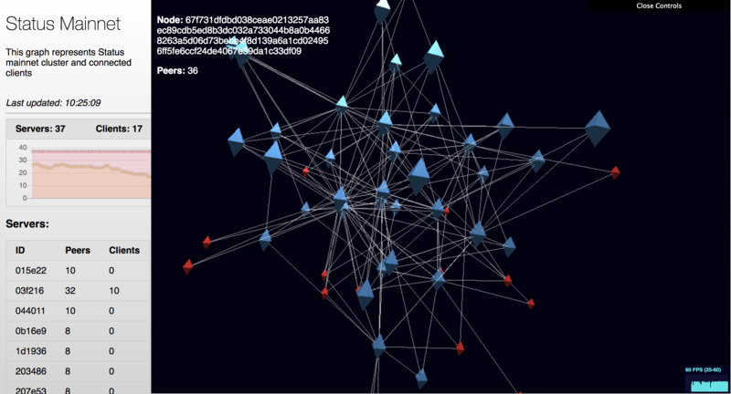

# ClusterViz - Cluster visualization tool for Status cluster

Clusterviz visualizes the real state of Status p2p cluster (only nodes we deployed) using WebGL.

# Installation

`go get github.com/status-im/clusterviz`

# Usage

First, you need to have an access to Status cluster. Ask you-know-who or hack servers. You should be able to talk to our Consul service to query nodes. Then simply run:

`./clusterviz`

It will print something like `Starting web server on :20002`. Point your browser to the IP of the server you're running program on and abovementioned port.

If you just want to hack on UI part without actually talking to servers, use `-test` flag. It will use sample data for testing purposes.

See `-help` flag output for more options.

# FAQ

 - Q. Why is it private repo?
 - A. There are some sensible enodes information in test data, need to be obfuscated first.

# License

MIT
